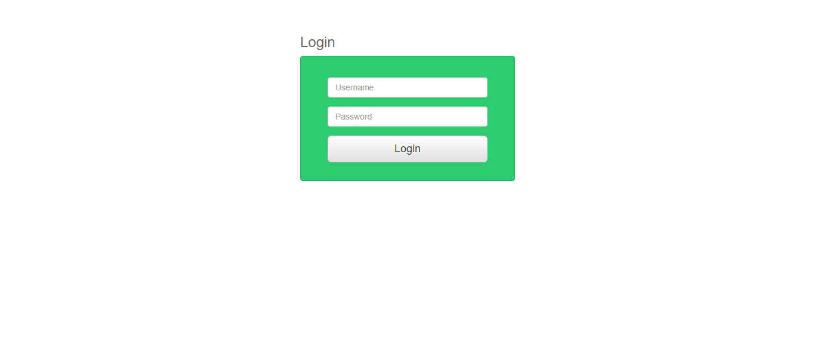
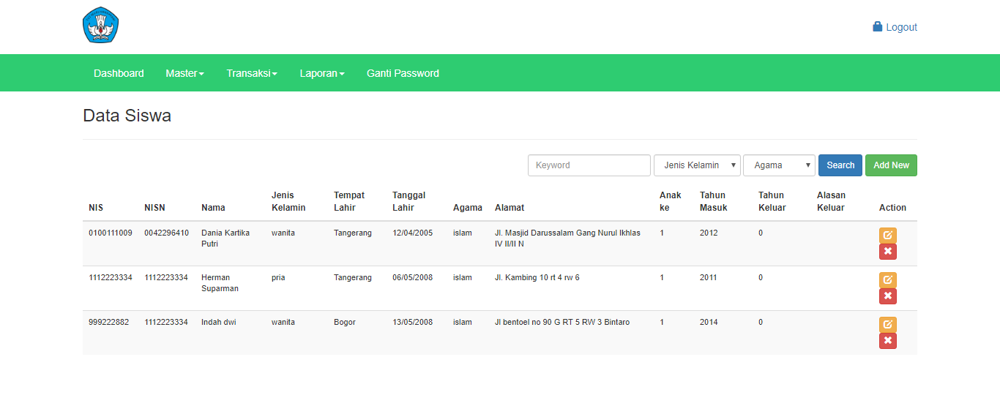
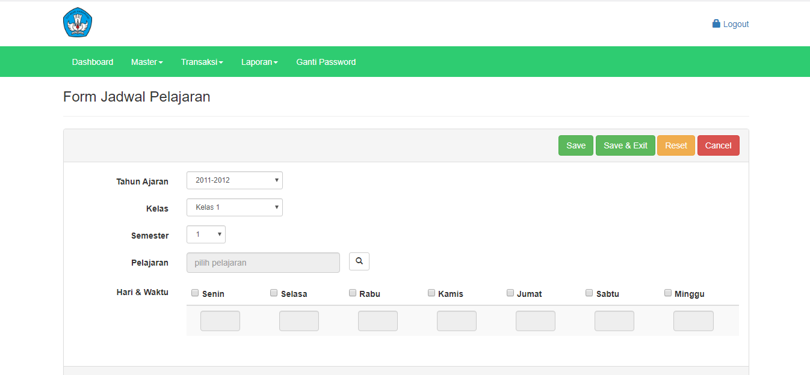

# Sistem Informasi Akademik (SIA) / Sistem Informasi Sekolah (SISKO)

Aplikasi ini dibuat mengunakan PHP Framework Codeigniter dan menggunakan database MYSQL

</img>
</img> 

</img>
</img>

## Fitur
#### Login
#### Menu Utama
#### Data Master
- Form Data User
- Form Data Siswa
- Form Data Guru
- Form Data Kelas
- Form Data Pelajaran
- Form Data Tahun Ajaran
- Form Data Jenis Nilai
- Form Data Ekstrakulikuler
- Form Data Kepribadian
#### Transaksi
- Form Kelas Siswa
- Form Wali Kelas
- Form Guru bidang studi
- Form Jadwal
- Form Absen
- Form Nilai Pelajaran Siswa
- Form Nilai Kepribadian Siswa
- Form Nilai Ekstrakulikuler
- Form Pengumuman
#### LAPORAN
- Laporan Siswa
- Laporan Nilai Kepribadian Siswa
- Laporan Nilai Pelajaran Siswa
- Laporan Nilai Ekstrakulikuler
- Laporan Jadwal
- Laporan Raport Siswa
#### SETTING CHANGE PASSWORD
